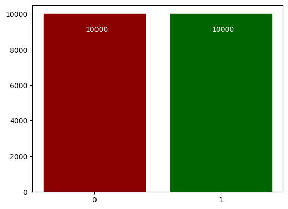
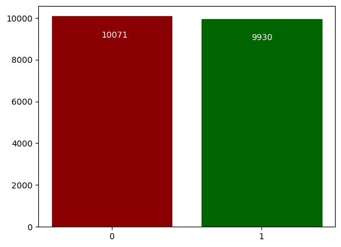
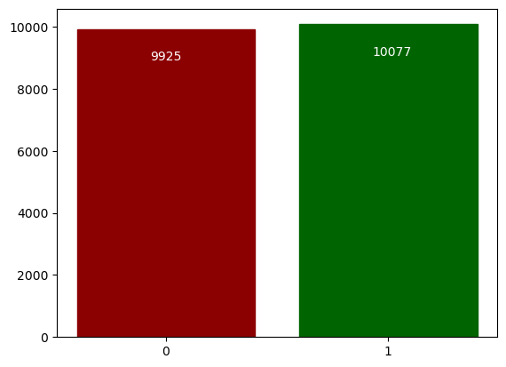
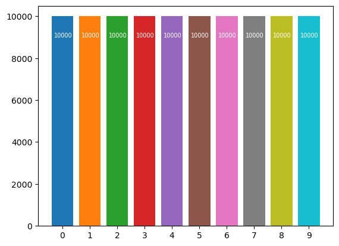
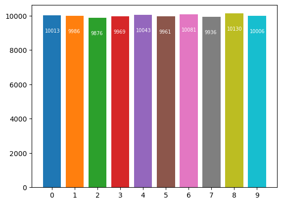
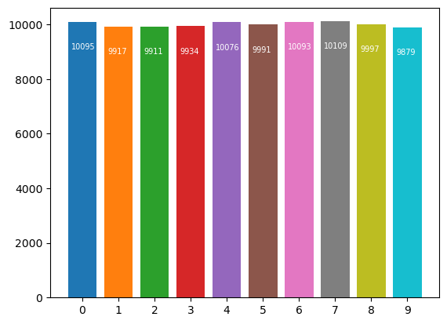
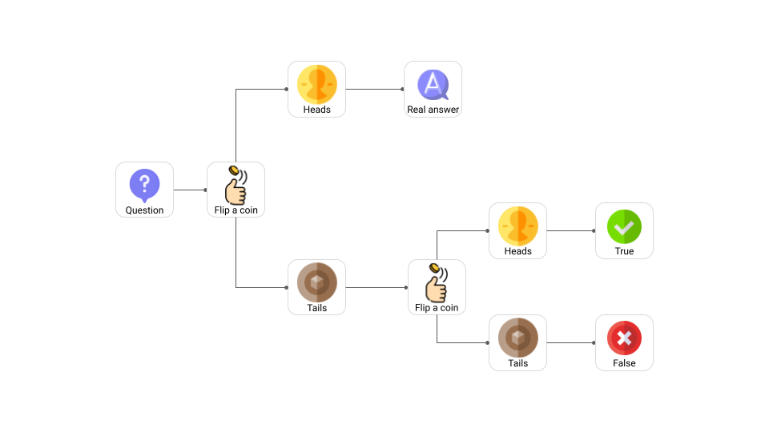

# simpleDP
Simple binary and decimal implementations of a **Differential Privacy** algorithm.

Differential Privacy (DP) is a system for publicly sharing information about a dataset by describing the patterns of groups within the dataset while withholding information about individuals in the dataset.

The idea behind Differential privacy is that if the effect of making an arbitrary single substitution in the database is small enough, the query result cannot be used to infer much about any single individual, and therefore provides privacy.

With this approach, the edited dataset can be used for statistical/training purposes.

Furthermore, adding a new information to the dataset and applying the Differential Privacy algorithm allows not to reveal its value has shown in the following plots.

## Results:

- Binary implementation (*dp-binary.ipynb*):

    >**Stats of the original dataset:**\
    >

    >**After adding one bit with value 1:**\
    >\
    >**The new bit is identifiable**

    >**Stats after DP algorithm**\
    >

    >**Stats after adding one bit and after DP algorithm**\
    >\
    >**The new bit is not identifiable**

- Decimal implementation (*dp-decimal.ipynb*):

    >**Stats of the original dataset:**\
    >

    >**After adding one bit with value 1:**\
    >\
    >**The new bit is identifiable**

    >**Stats after DP algorithm**\
    >

    >**Stats after adding one bit and after DP algorithm**\
    >\
    >**The new bit is not identifiable**

## DP Algorithm
